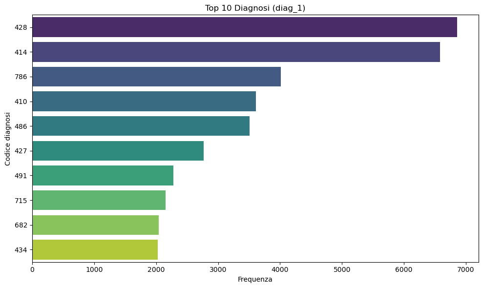
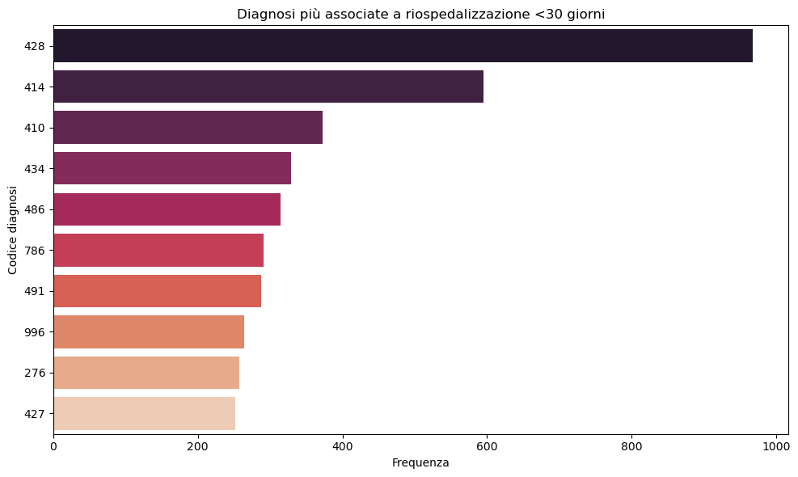
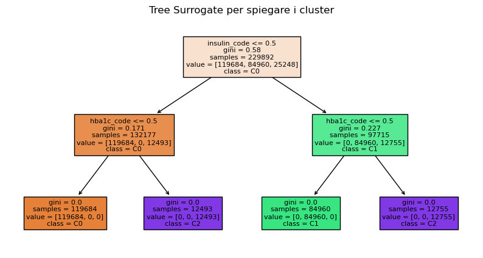
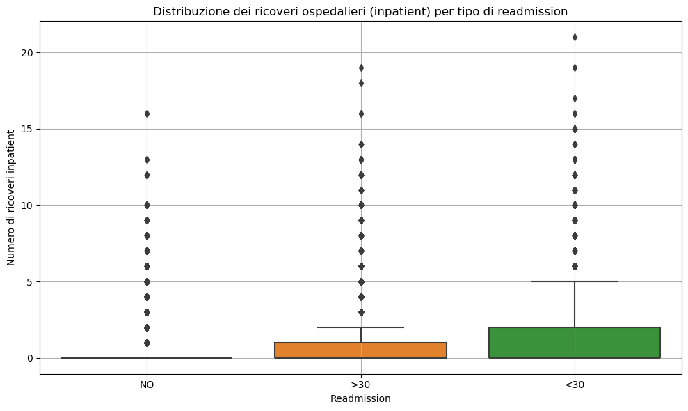
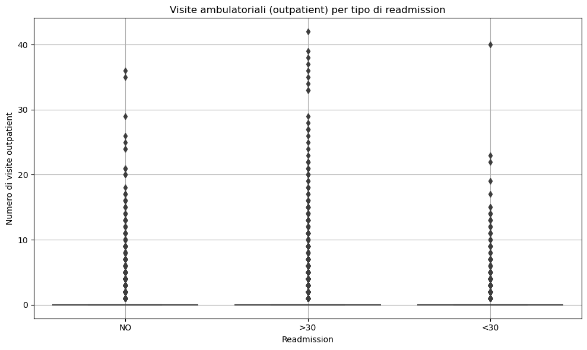
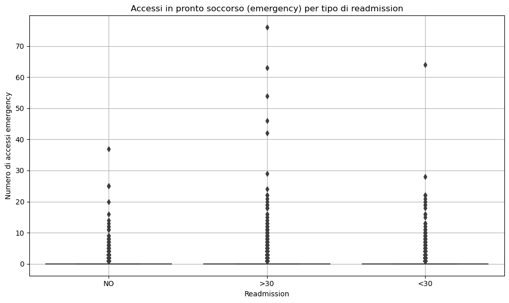

# 🏥 Diabetes Readmission Analysis with dbt + DuckDB + Python

A complete analytics pipeline to explore, transform, and explain hospital readmission patterns in diabetic patients using modern tools like **dbt**, **DuckDB**, **UMAP**, **HDBSCAN**, and **LIME**.

# 🩺 Diabetes Readmission Project

---

## 📦 Dataset

- **Source**: `diabetic_data.csv` (UCI Machine Learning Repository)
- **Patients**: 101,766 with diabetes
- **Target**: `readmitted` → `<30`, `>30`, `NO`
- **Features**: Diagnoses, hospital usage, procedures, medications

---

## 🧱 Project Structure (DBT + Python)

📁 diabetes-readmission-dbt/
│
├── data/
│ ├── diabetic_data.csv
│ └── diabetes.duckdb # DuckDB database
│
├── dbt-project/
│ ├── models/
│ │ ├── staging/
│ │ │ ├── stg_patients.sql
│ │ │ ├── stg_encounters.sql
│ │ │ ├── stg_diagnoses.sql
│ │ │ ├── stg_treatments.sql
│ │ │ └── stg_hospital_use.sql
│ │ └── marts/
│ │ ├── mart_readmission_analysis.sql
│ │ ├── mart_diagnosis_risk_factors.sql
│ │ └── mart_hospital_usage.sql
│
├── notebooks/
│ ├── 01_analysis_readmission.ipynb
│ ├── 02_diagnosis_analysis.ipynb
│ └── 03_hospital_usage_analysis.ipynb

---

## 📊 Analisi clinico-descrittiva

### Distribuzione `readmitted`

| Classe    | Numero pazienti |
|-----------|-----------------|
| `>30`     | 109,596          |
| `NO`      | 75,970           |
| `<30`     | 44,326           |

---

### Diagnosi principali (da `diag_1`, `diag_2`, `diag_3`)

- Codici più frequenti: `428` (insufficienza cardiaca), `414` (malattia coronarica), `786` (dispnea)
- Diagnosi più associate a riospedalizzazione entro 30 giorni: `428`, `414`, `410`

📸  
  

---

## 🧬 Clustering pazienti con explainability

- One-hot encoding su diagnosi
- Clustering non supervisionato: **HDBSCAN**
- Visualizzazione con **UMAP** 2D/3D
- Interpretazione locale con **LIME**

📸  
  
*Spiegazione locale del cluster con diagnosi dominanti nel paziente 42*

---

## 🏥 Analisi utilizzo ospedale

Mart `mart_hospital_usage.sql` integra:

- `number_inpatient`: ricoveri precedenti
- `number_emergency`: accessi PS
- `number_outpatient`: visite ambulatoriali

📈 Boxplot comparativi:

| Variabile | Grafico |
|----------|--------|
| Ricoveri inpatient |  |
| Visite ambulatoriali |  |
| Accessi emergenza |  |

🔎 I pazienti readmitted `<30` mostrano valori più alti di `number_inpatient` e `number_emergency`.

---

## 🚀 Come eseguire

### 1. Installa i pacchetti richiesti
pip install -r requirements.txt
2. Esegui la pipeline dbt
bash
Copia
Modifica
dbt run

3. Esplora i notebook interattivi
📊 01_analysis_readmission.ipynb – Overview sulla distribuzione delle riospedalizzazioni

🧬 02_diagnosis_analysis.ipynb – Analisi dei codici ICD e clustering con explainability

🏥 03_hospital_usage_analysis.ipynb – Analisi dell’utilizzo ospedaliero e associazione con il rischio

### 🧰 Tecnologie utilizzate 
dbt + DuckDB per gestione dati e trasformazioni SQL
Python con librerie: pandas, seaborn, hdbscan, umap-learn, lime
Ambiente di sviluppo: Visual Studio Code, JupyterLab, Git

## ✍️ Autore
Dante Trabassi
Biomedical Engineer · PhD Neuroscience · AI for Movement & Health
📧 Email: dantetrb@gmail.com
🔗 ResearchGate Profile

## 📄 Licenza
Questo progetto è distribuito sotto licenza MIT.